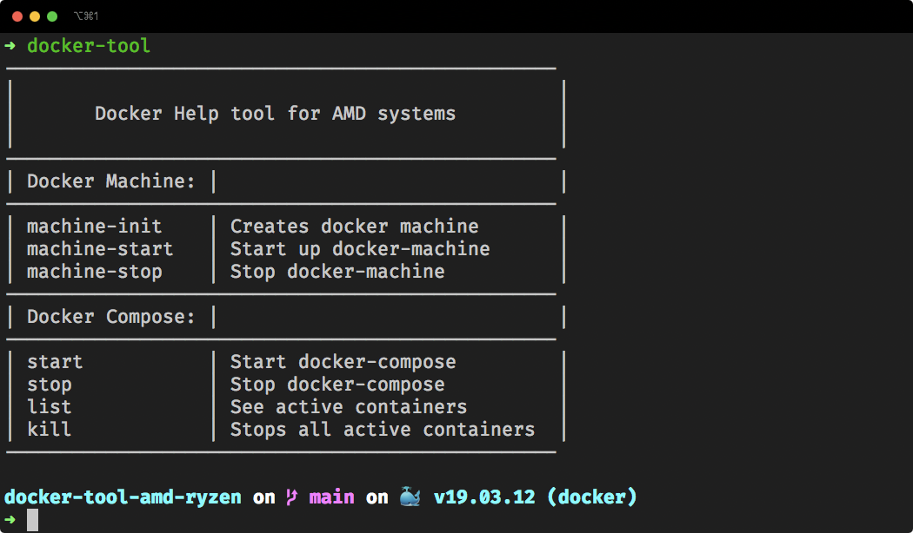

# docker-tool-amd-ryzen

There is no way to install Docker Desktop on Ryzen CPU's.
So i made this neat little tool to run docker on AMD Ryzen Systems!

### Installation

```sh
$ git clone git@github.com:jacoweb/docker-tool-amd-ryzen.git
$ cd docker-tool-amd-ryzen
$ chmod +x docker-tool.sh
$ ln -s docker.sh /usr/local/bin/docker-tool
$ docker-tool
```

